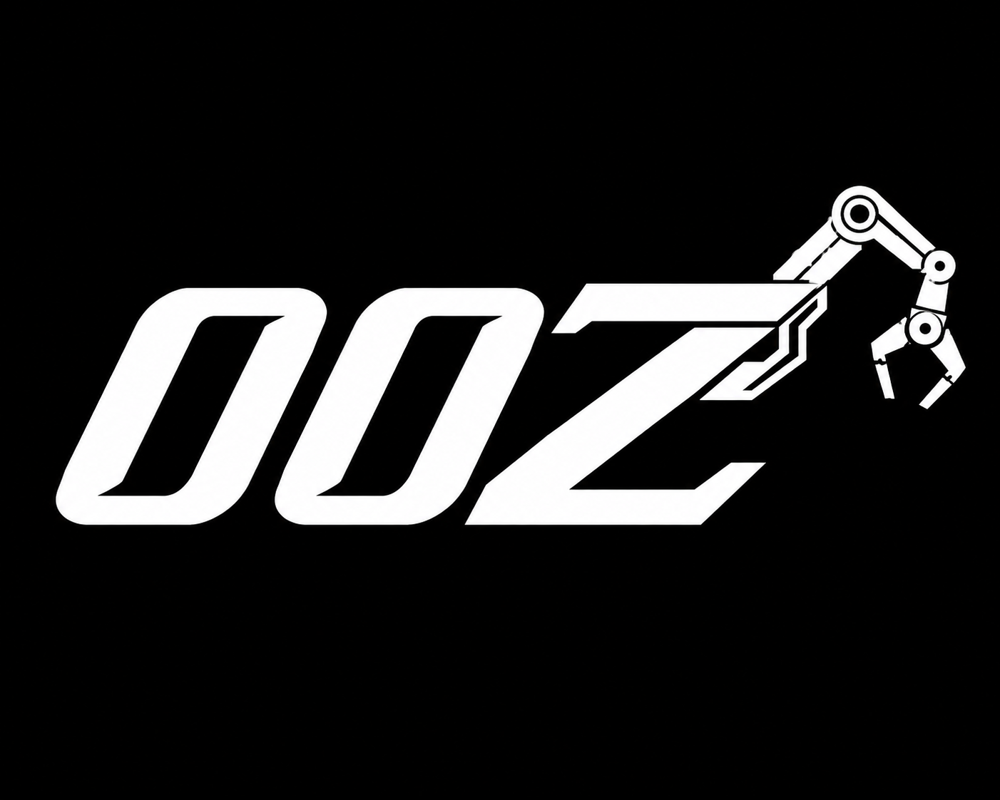

# 00Z — The ZEN Agent

<p align="center">
  
</p>

**Experimental local harness template for structured AI-agent workflows with Claude and pi-agent.**

[](docs/readiness.md)
[](LICENSE)
[](docs/architecture.md)

## In short

00Z is a **security-first, local-first** agent harness template. It brings **gates, prompts, memory models, and pipeline flow** into one coherent structure so you can prototype and study AI-agent orchestration without switching to a production runtime.

> ⚠️ This is an **experimental** project. It is intentionally conservative and not production software.

## Why 00Z exists

AI-agent projects often combine prompts, permissions, tools, and runtime rules in many places.
That makes them hard to reason about and easy to misconfigure.

00Z makes these parts explicit and inspectable:

- declarative behavior in Markdown/YAML artifacts
- explicit safety boundaries (filesystem, prompts, secrets, tools, policies)
- validation before mutation
- separated planning, execution, memory, and release-readiness phases
- lightweight adapter integration for Claude and pi-agent workflows

## What 00Z is **not**

- A finished Agent OS
- A production API/connector platform
- A native runtime that executes live destructive writes by default
- An automatic deployment or GitHub publishing pipeline

## Current capabilities

- **YAML-first harness** with machine-readable schemas
- **Agent and prompt templates** in Markdown
- **Pi and Claude adapter layer**
- **5-layer memory** concept
- reasoning + pipeline model for structured workflows
- local validation tooling (no destructive defaults)
- explicit write-boundary design (`productive writes` stay disabled until explicit approval)

## Quick start

From repository root:

```bash
PYTHONDONTWRITEBYTECODE=1 python3 tools/zen_validate.py --check-only
```

If this is green, your core local safety checks are passing.

Typical output:

```text
ZEN VALIDATE: PASS
Mode: check-only/no-write
Summary: PASS=... WARN=... FAIL=0
```

### Optional: read-only orientation

```bash
PYTHONDONTWRITEBYTECODE=1 python3 tools/zen_onboarding.py --linear --no-color
```

## Typical workflow

```text
Read docs/welcome.md
→ run the validation demo
→ inspect readiness/status docs
→ plan changes
→ keep mutation gated
→ run explicit snapshot/handoff after review
```

## Project structure

```text
core/          identity, orchestrator, boot protocol
harness/       policies, schemas, pipelines, commands
adapters/      Pi and Claude integration placeholders
agents/        system agents and templates
prompts/       prompt templates and snapshots
kontext/       memory and reasoning artifacts
validation/    gate definitions, fixtures, reports
tools/         local validators and smoke tests
docs/          public and operator documentation
```

## Core docs

- [`docs/getting-started.md`](docs/getting-started.md)
- [`docs/welcome.md`](docs/welcome.md)
- [`docs/commands.md`](docs/commands.md)
- [`docs/readiness.md`](docs/readiness.md)
- [`docs/release-status.md`](docs/release-status.md)

## Safety boundaries

- No production-ready runtime claims
- No native Pi/Claude runtime activation
- No API/connector platform claims
- No automatic dependency installation
- No `.env` secret read/write behavior
- No built-in GitHub/deploy publishing flow
- Productive writes require explicit gates and human confirmation

## Release posture

This repository is documented as an **experimental local release**. For current status, see:

- [`docs/release-status.md`](docs/release-status.md)
- [`docs/readiness.md`](docs/readiness.md)

## Who it is for

- people exploring AI-agent architecture
- developers who want safer local AI workflows
- reviewers and learners looking at gate-based design
- builders creating their own harness templates

## License

00Z is licensed under the [MIT License](LICENSE).

## About the name

`00Z` is short for **The ZEN Agent**: a compact, configurable template you can adapt to your own agent workflow.

## Logo optional guide

To use or replace the logo in README:

1. place the final image at `assets/00z-logo.png`
2. use the centered `` block near the top of this README
3. keep `width="250"` for a subtle GitHub README header

